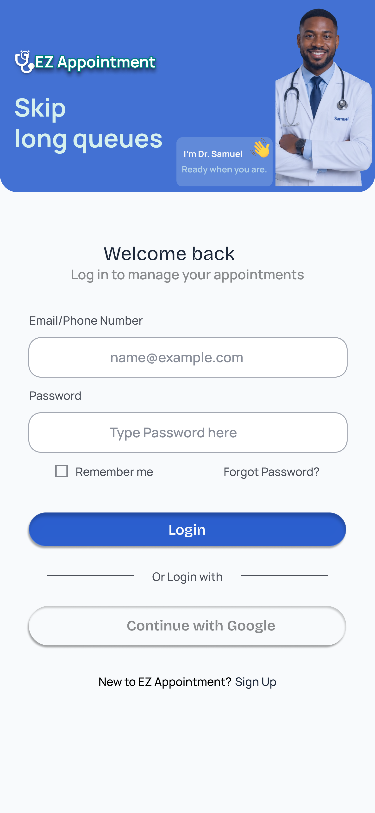
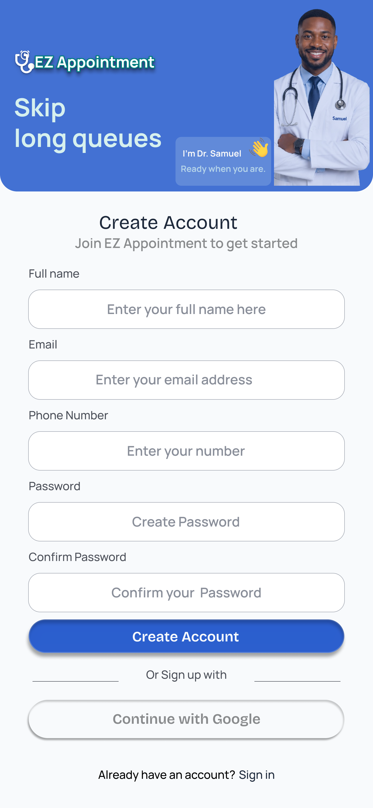
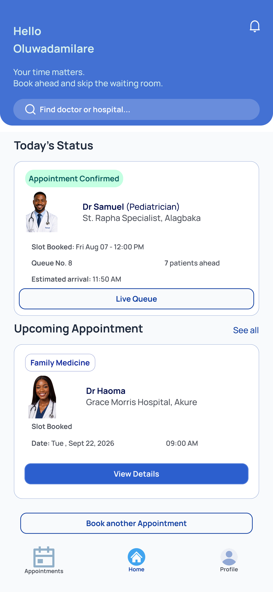
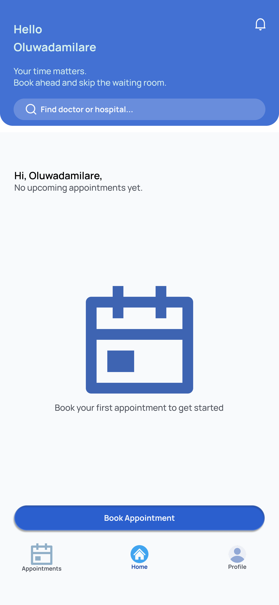
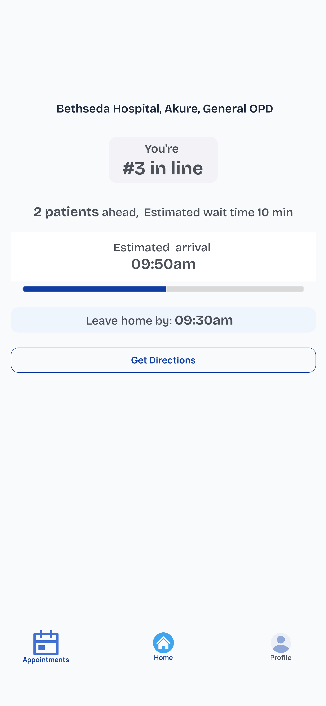

# EZ Appointment 
 
## Table of Contents 
 
- [Overview](#overview) 
- [Built With](#built-with) 
- [Features](#features) 
- [How It Works](#how-it-works) 
- [Design Process](#design-process) 
- [Project Screens](#project-screens) 
- [Demo](#demo) 
- [Repository](#repository) 
- [Acknowledgements](#acknowledgements) 
- [Author](#author) 
 
## Overview 
 
EZ Appointment is a responsive hospital appointment booking and queue management prototype designed to help busy patients in private hospitals in Nigeria book appointments ahead of time, avoid unnecessary waiting-room queues, and know when to arrive. 
 
The project focuses on making appointment booking simple, clear, and efficient. 
 
### The Core Problem 
 
Patients can spend hours waiting at hospitals without knowing how long they will actually wait. 
 
EZ Appointment allows patients to book an appointment slot, get placed in a queue, and see their queue position and suggested leave-home time. This helps patients arrive closer to their turn instead of spending unnecessary time in the waiting room. 
 
### What I Learned 
 
I learned how much good UX is about managing uncertainty, not just layout. 
 
Building the queue screen taught me to design for multiple states, including normal and urgent situations, instead of designing one static screen. 
 
I also learned to scope aggressively. I started with 13+ screens and reduced the project to 10 core screens to keep the user journey focused. 
 
Through this project, I improved my understanding of: 
 
- User-centred design 
- Appointment booking workflows 
- Responsive web design 
- Figma prototyping 
- HTML, CSS, and JavaScript 
- Designing interfaces for healthcare users 
 
## This project was built with 
 
- Figma 
- HTML 
- CSS 
- JavaScript  
 
## Features 
 
- **Login / Sign Up:** Email or phone and password authentication, with a toggle between returning users and new accounts. 
- **Home Dashboard:** Shows the user's upcoming appointment and queue status, or an empty state prompting new patients to book their first appointment. 
- **Book Appointment:** Patients can select a hospital, department, and health provider. They can also choose "No Preference" to allow any available provider and minimize waiting time. 
- **Appointment Review:** Patients can review and edit their selected appointment details before confirmation. 
- **Appointment Confirmation:** Displays the confirmed appointment details and queue information. 
- **Queue Status:** Shows the patient's queue number, estimated waiting time, and a Google Maps view for directions to the facility. 
- **Calendar Reminder:** Patients can add their appointment to their calendar. 
- **Responsive Design:** The interface is designed to work across different screen sizes. 
 
## How It Works 
 
1. Patient logs in. 
2. Patient accesses the home page and views their upcoming appointment. 
3. New patients without an existing appointment see an empty state prompting them to book. 
4. Patient starts the appointment booking process. 
5. Patient selects a hospital. 
6. Patient selects a department and health provider. 
7. Patient selects an available date and time. 
8. Patient reviews the appointment details. 
9. Patient confirms the appointment. 
10. Patient checks their queue status. 

 
## The design process included: 
 
- User research 
- Persona development 
- User journey mapping 
- Wireframing 
- High-fidelity UI design 
- Prototyping 
 
## Project Screens

### Login

### Sign Up

### Home

### Book Appointment

### Queue Status

## Demo 
 
[Netlifyl Live Demo](https://myehacapstoneproject.netlify.app/)
 
## Repository 
 
[GitHub Repository](https://github.com/Ginnie1/EZ-Appointment)
 
## Acknowledgements 
 
- eHealth Africa Academy 
 
## Author 
 
**Chioma**
